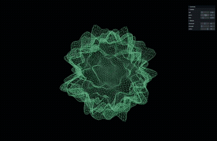

# Audio Visualiser
# Audio Visualiser

This is the code for a 3D Audio visualizer using Three.js

To run:
1. Clone the repository;
2. Open the folder in Visual Studio Code;
3. Open the terminal and type this command: npm install
5. Run the app on the server by typing this command: npx vite
6. Ctrl + click on the server link "http://localhost:5173/" to open the app in your browser;

I followed along this tutorial by Wael Yasmina: "https://waelyasmina.net/articles/how-to-create-a-3d-audio-visualizer-using-three-js/#animate_blob"

For noise, I used "https://github.com/ashima/webgl-noise"

TODO:
Add options for the user to control the color and surface texture of the blob
Also add option for user to upload the audio file
Add a button to pause and resume the song